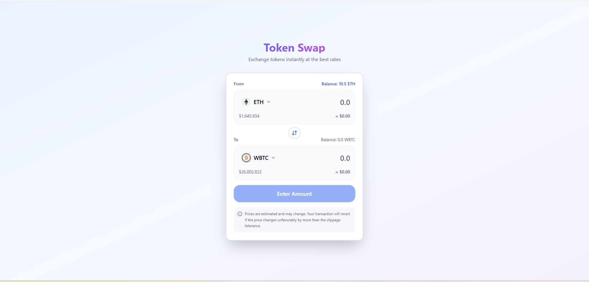
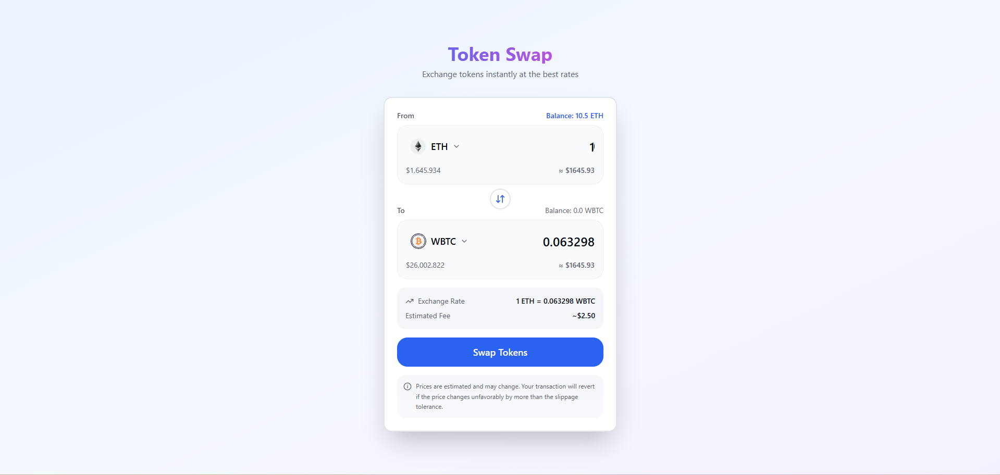
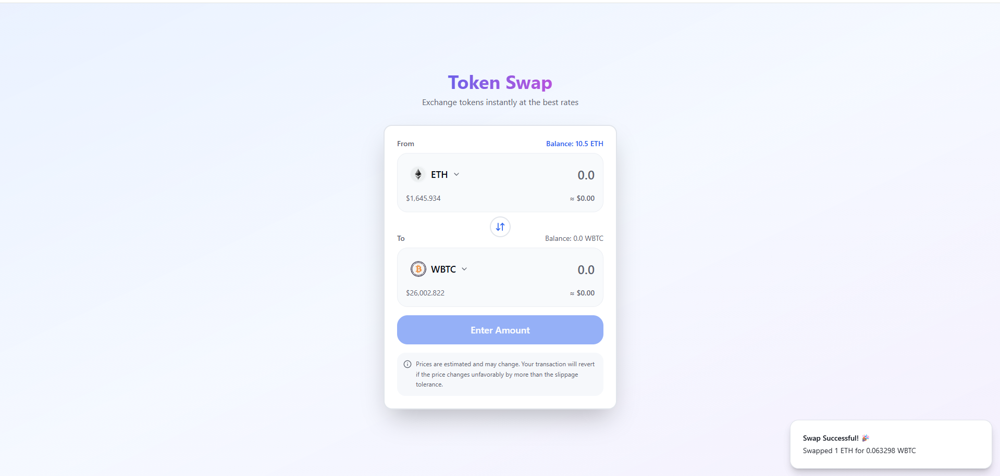
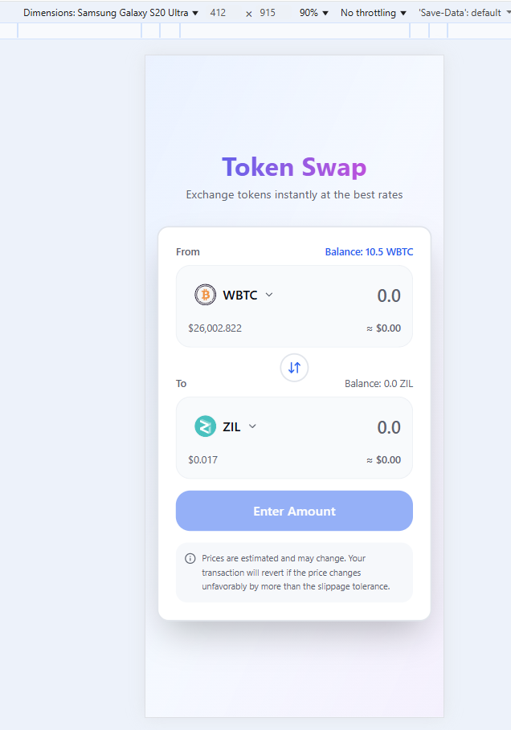
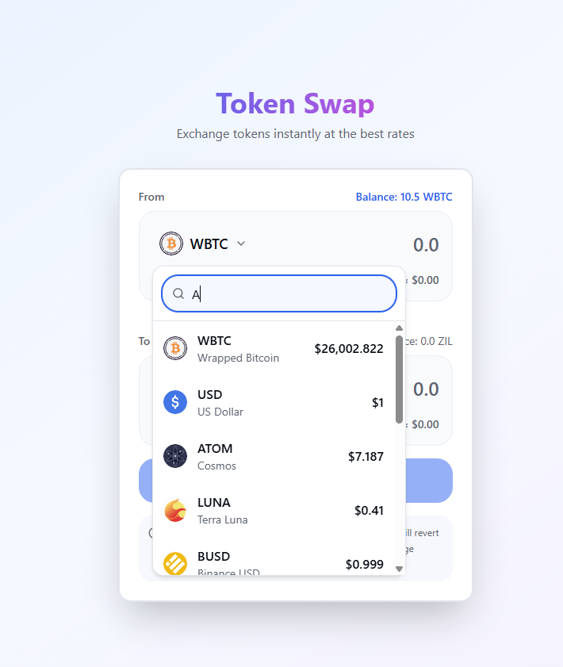

# 🪙 Token Swap

Exchange tokens instantly at the best rates.  
This project provides a clean and modern token swap interface built with **React + Vite**, styled using **Tailwind CSS**, and powered by live crypto price data.





---

## 📂 Folder Structure
```
src/
├── components/
│   ├── atoms/          # Small reusable UI components
│   ├── molecules/      # Combined UI elements (e.g., input + label)
│   └── organisms/      # Larger UI blocks or sections
├── hooks/              # Custom React hooks
├── lib/                # Utility functions (e.g., cn, formatPrice)
├── types/              # TypeScript definitions
├── App.tsx
├── index.css
└── main.tsx

public/
└── assets/             # Token SVG icons (1INCH.svg, AAVE.svg, etc.)
```

---

## 📦 Install Dependencies

Make sure you have **pnpm** installed globally:
```bash
npm install -g pnpm
```

Then install all project dependencies:
```bash
pnpm install
```

---

## 🚀 Run the Development Server

Start the Vite development server:
```bash
pnpm dev
```

Your app will be available at:

👉 **http://localhost:5173**

---

## 🎨 Features

- 🔄 Real-time token swapping interface
- 💰 Live crypto price data integration
- 🎯 Clean and intuitive UI/UX
- 📱 Fully responsive design
- ⚡ Fast and optimized with Vite
- 🎨 Styled with Tailwind CSS
- 🖼️ Dynamic token icons from `/public/assets/`

---

## 🛠️ Tech Stack

- **React 18** - UI framework
- **TypeScript** - Type safety
- **Vite** - Build tool and dev server
- **Tailwind CSS** - Utility-first styling
- **Lucide React** - Icon library